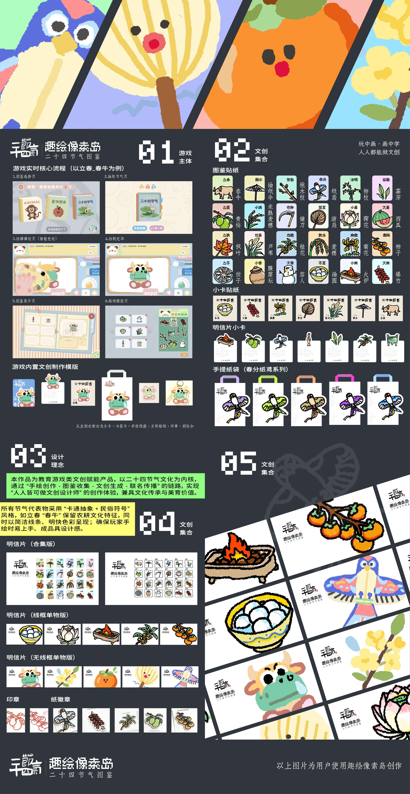
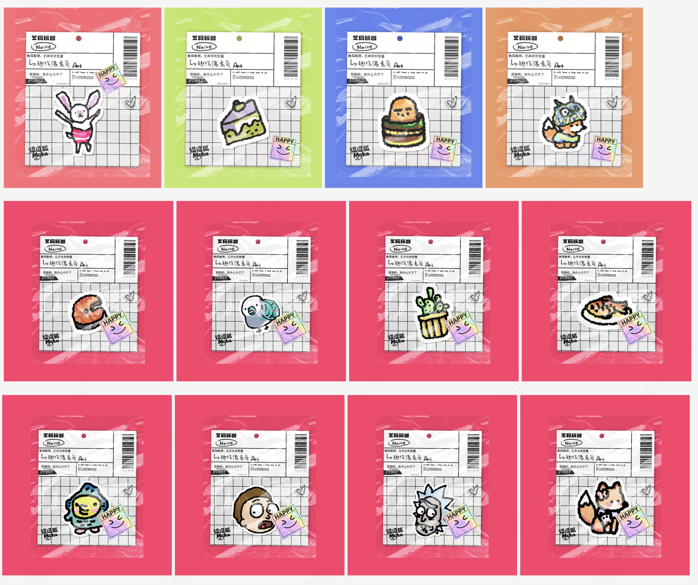
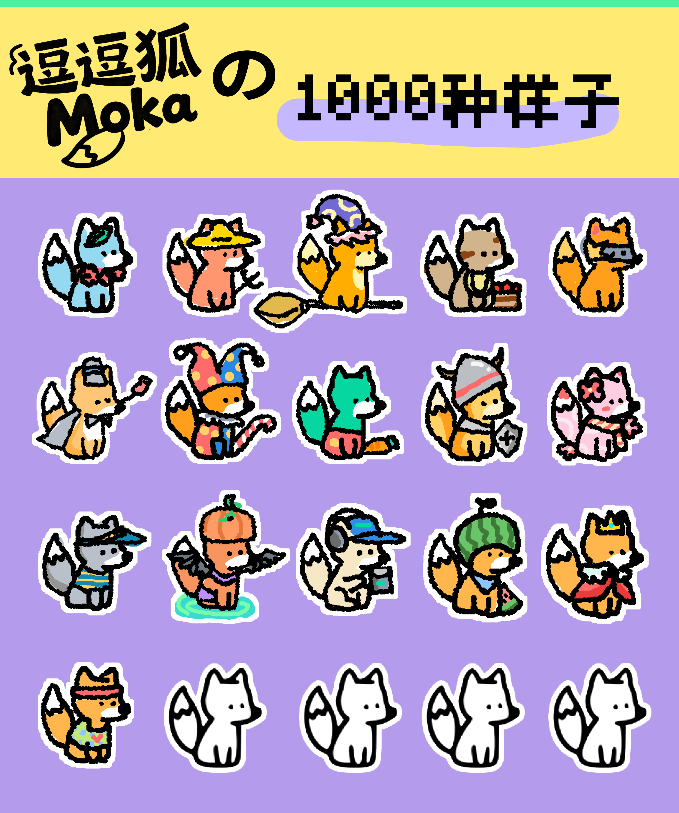
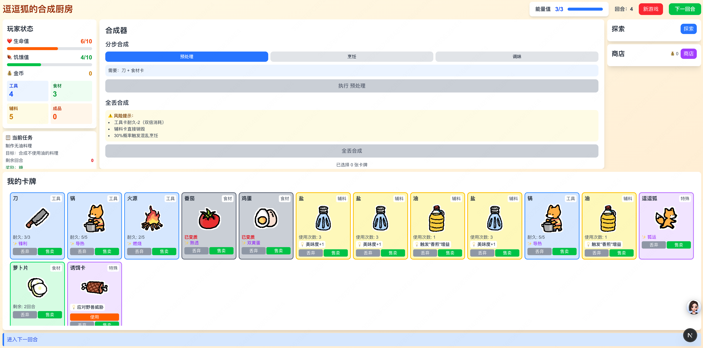
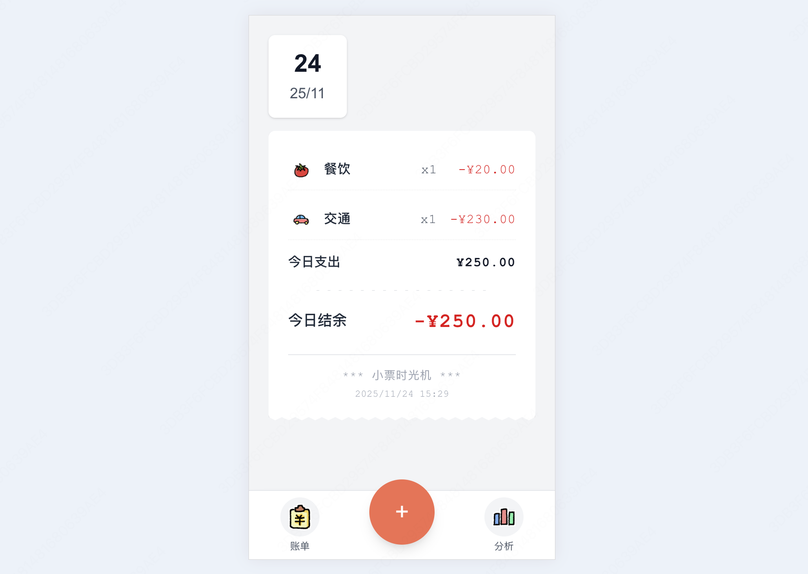
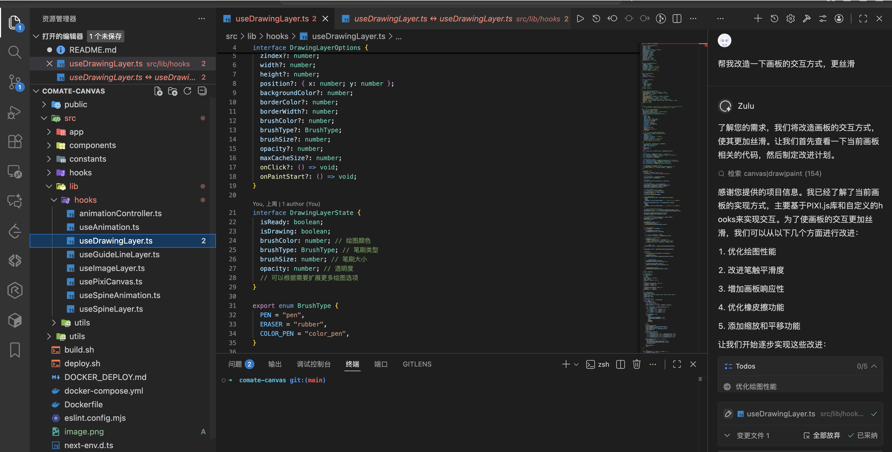
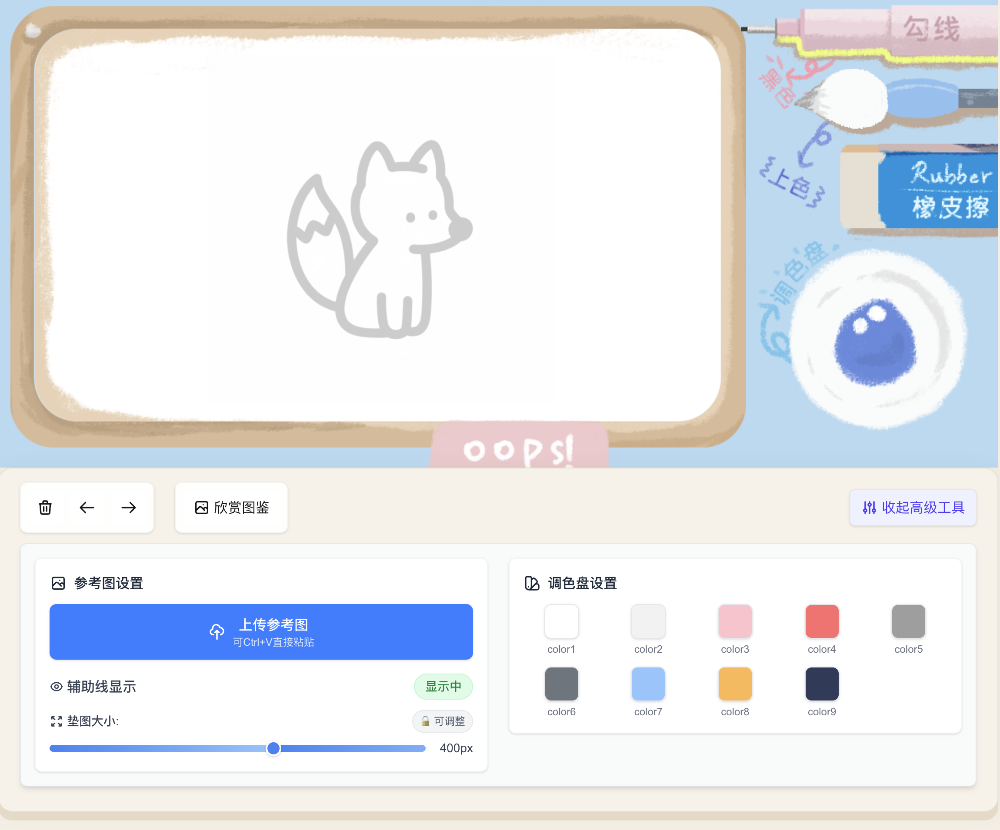

# Comate Canvas 项目

基于 Next.js 的交互式画布应用，支持 PixiJS 和 Spine 动画。

## 功能特性

- **交互式画布**: 基于 PixiJS 构建的高性能 2D 渲染引擎
- **Spine 动画**: 支持 Spine 动画，集成 PixiJS-Spine
- **图层管理**: 使用 @pixi/layers 进行多图层管理
- **React 集成**: 基于 Next.js 框架的现代 React 19 组件
- **动画控制**: 自定义动画管理钩子
- **绘图工具**: 画笔设置和绘图功能

## 技术栈

- [Next.js](https://nextjs.org) (v15.4.6)
- [PixiJS](https://pixijs.com) (v7.0.0) 支持 Spine
- [React](https://react.dev) (v19.0.0)
- TypeScript
- TailwindCSS

## 开始使用

首先，安装依赖：

```bash
npm install
# 或
yarn install
# 或
pnpm install
```

然后，启动开发服务器：

```bash
npm run dev
# 或
yarn dev
# 或
pnpm dev
# 或
bun dev
```

在浏览器中打开 [http://localhost:3000](http://localhost:3000) 查看结果。

## 项目结构

```
comate-canvas/
├── src/
│   ├── app/                 # Next.js App Router 页面
│   │   ├── chapter/         # 章节页面
│   │   ├── create/          # 创建页面
│   │   ├── menu/            # 菜单页面
│   │   ├── select/          # 选择页面
│   │   ├── showdetail/      # 详情页面
│   │   ├── sticky/          # 置顶页面
│   │   └── layout.tsx       # 应用布局
│   ├── components/          # React 组件
│   │   ├── ai-analyze-tool/ # AI 分析组件
│   │   ├── animation-text/  # 动画文本组件
│   │   ├── brush-settings/  # 画笔设置组件
│   │   └── custom_modal/    # 自定义弹窗组件
│   ├── lib/                 # 画布和动画钩子
│   │   └── hooks/
│   │       ├── animationController.ts
│   │       ├── useAnimation.ts
│   │       ├── useDrawingLayer.ts
│   │       ├── useGuideLineLayer.ts
│   │       ├── useImageLayer.ts
│   │       ├── usePixiCanvas.ts
│   │       ├── useSpineAnimation.ts
│   │       └── useSpineLayer.ts
│   ├── utils/               # 工具函数
│   │   ├── posterExample.ts
│   │   ├── posterGenerator.ts
│   │   └── README.md
│   └── constants/           # 应用常量
├── public/                  # 静态资源
│   ├── assets/
│   │   └── spine/           # Spine 动画资源
│   └── images/              # 图片资源
└── package.json             # 依赖和脚本
```

## 开发说明

项目使用多个关键钩子来实现画布功能：

1. **usePixiCanvas**: 主画布设置和管理
2. **useSpineLayer**: Spine 动画集成
3. **useDrawingLayer**: 绘图功能
4. **useImageLayer**: 图片图层管理
5. **useAnimation**: 动画控制

## 可用脚本

- `npm run dev` - 启动开发服务器
- `npm run build` - 构建生产版本
- `npm run start` - 启动生产服务器（端口 3002）
- `npm run lint` - 运行 ESLint

本项目使用 [`next/font`](https://nextjs.org/docs/app/building-your-application/optimizing/fonts) 自动优化和加载 [Geist](https://vercel.com/font)，这是 Vercel 的一个新字体家族。

## 了解更多

要了解更多关于 Next.js 的信息，请查看以下资源：

- [Next.js 文档](https://nextjs.org/docs) - 了解 Next.js 功能和 API
- [学习 Next.js](https://nextjs.org/learn) - 交互式 Next.js 教程

您可以查看 [Next.js GitHub 仓库](https://github.com/vercel/next.js) - 欢迎提供反馈和贡献！

## 部署指南

### Vercel 部署

最简单的部署方式是使用 [Vercel 平台](https://vercel.com/new?utm_medium=default-template&filter=next.js&utm_source=create-next-app&utm_campaign=create-next-app-readme)，这是 Next.js 的创建者提供的服务。

查看 [Next.js 部署文档](https://nextjs.org/docs/app/building-your-application/deploying) 获取更多细节。

### Docker 部署

本项目支持 Docker 容器化部署。详见 [DOCKER_DEPLOY.md](DOCKER_DEPLOY.md) 获取详细部署指南。

**快速 Docker 设置:**
```bash
# 构建 Docker 镜像
./build.sh

# 使用 Docker Compose 部署
./deploy.sh
```

## 贡献指南

1. Fork 本仓库
2. 创建特性分支 (`git checkout -b feature/amazing-feature`)
3. 提交您的修改 (`git commit -m '添加了很棒的特性'`)
4. 推送分支 (`git push origin feature/amazing-feature`)
5. 发起 Pull Request

## 支持

如果遇到任何问题：
- 查看项目文档
- 参考 Docker 部署指南
- 在仓库中创建 issue

---

感谢使用 Comate Canvas！🎨✨


# 作品介绍

## 〇、产品介绍
- 【拯救“画渣”计划】  
孩子画画总遇三大难题：不会画、画不好、画完闲置——绘趣像素岛全程陪伴指导，让每幅涂鸦都能变身实用小贴纸。
- 【你的专属绘画教练】  
当孩子画笔受阻时，智能辅助线与六维能力图即时相助，让创作过程充满成就感，作品直接转化为手账素材。
- 【学霸天团造萌器】  
团队集结北大、电子科大等名校技术大牛与绘画教师，用算法读懂童心，打造真正懂孩子的智能绘画伙伴。    

体验链接：  
https://zhypower42-free-canvas.ms.show/

视频链接：  
https://u1rr3mj7a4.feishu.cn/docx/P5tqd2iRhoLSUDxgEa7cYnEYnXe


## 一、项目背景
学画画常遇 “画什么、怎么画、画得咋样、画完咋用” 四个难题。趣绘像素岛通过AI能力解决这四个问题，首先通过预设三种类目的图鉴（每一次生成都不一样，充满开盲盒的未知趣味感）结合场景化自由创作（按用户意图生成天马行空的场景，培养想象力）解决画什么的问题，然后通过智能辅助线、步骤拆解和实时分析解决怎么画的问题，用户画完后通过整体评价和6个维度（色彩、造型、结构、线条、质感、辨识度）能力雷达图解决画的如何的问题，通过图鉴展示和进行文创衍生物、贴纸DIY、手帐素材、表情包等一系列社交属性的行为，展现成就感，让画完之后的东西能够被利用好，从学画、动笔、展评到用画，帮用户轻松搞定绘画学习。
## 二、应用基本情况
“趣绘像素岛” 是一款专为儿童量身打造的插画创作平台。以趣味化引导为核心，打破传统绘画学习的枯燥感，让儿童在轻松互动中激发绘画兴趣，逐步培养创造力与色彩感知能力，为艺术启蒙注入鲜活动力。为了给儿童提供丰富的创作方向，平台精心设计了多样化绘画主题（动物、食物、工具等）供选择。在创作过程中，AI 会智能生成步骤提示词与辅助引导线，降低绘画门槛；儿童完成创作后可进行AI点评，一键收录至「我的图鉴」，方便留存与回顾，打造专属于自己的创意作品集。图鉴可以支持拓展，可看附件二十四节气图鉴，儿童可以在教学步骤指导下进行绘画创作学习，尤其是缺乏美育教育资源的乡村孩童。
## 三、技术实现细节
为什么好看：为7个主要页面制作了30+动效，让用户每一次交互都能得到反馈。
怎么画都好看：使用特制抖动笔刷、智能色板、智能分层，使得画面独具风格。采用洪水填充算法，使得生成的贴纸怎么贴都好看。
为什么智能：采用sketchProcessor分割算法，结合6大Agent、绘画技法知识库以及多条工作流，能够科学合理组织步骤和图像，多个维度进行ai点拨和6维度能力雷达体系进行评分。同时我们训练专属风格LoRA模型，稳定生成符合儿童绘画的简笔画线稿。
## 四、价值描述
**【主要用户受众】** 儿童、宝妈、喜欢手工手帐的女性群体、缺乏专职美术教师背景下的乡村儿童、缺乏专业教学场景中的学童。  
对于学习者：可以通过应用进行有结构有章法的绘画学习，知其所以然。  
对于创作者：可以通过画板进行作品创作，进行如电子手帐素材、表情包、贴纸、纸夹相卡等文创作品产出获取收益，在社区售卖文创作品。  
对于教学者：可以产出绘画步骤和辅助图，为学习者提供教学素材，并可以进行打包收费。
对于经营者：可以推出联名活动增加知名度，同时通过画板与用户建立制作链接，如打印、定制印章等，获取收益。  
公益需求  
教育部《中国农村教育发展报告2023》数据显示：我国40%的乡村小学缺乏专职音体美教师，92%的乡村学校没有专职美术教师。72%的村小教师需跨学科教学，非专业任教成为乡村学校常态。非专业的美术老师“不会教、教不会”，成为乡村教育难题。
## 五、作品展示
文创展示



图鉴展示



卡牌游戏的UI


记账APP的UI




代码由文心快码辅助撰写优化


优化布局


